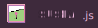

```go
    ,""""""""""""""""",^,"""""""""""",                   .-------------------------------------.   .---.
  .l ?]]]]]]]]]]]]]]]].~.????????????.I                 | SpcFORK :: Syntax Guru                |  |   |
 ",!l]IIIIIIIIIIIIIIII,< ]]]]]]]]]]]] l                 |   - "Asri or else nada!!"             |  |   |
 l ]]]lllllllllllllIII:> ]]]]]]]]]]]] l                 |   - I love making all software,       |  |   '----.
 l:iii>>>>>>>>>>>>>]]] ~ ]]]]]]]]]]]] l                 |                                       |  (________'
 l`++++++++++++++++---.~ ]]]]]]]]]]]] l                  '-------------------------------------'   ==========
 lIIIIIIIIIIIIIIIIIIII;~.??????----?? l                 
 lIlllllllllllllllllll:iI"""""",;:;''l;".               
 l;lllllllllllllllllll:l    '^,,Iii??]-i;".             
 `I,I:::::::::I,,,,,,,:`   ,;ii??]]]]]]]-i",            
   ,:iiiiiiiii:,          :IIii!!!!!!!?]]]I:"           
   l ]]]]]]]]] l           ^`````````l.]]]] i           
   l ]]]]]]]]] l                   .`l.]]]]?.I          
   l.?]]]]]]]] l         ,""""""""";!!?]]]]] l          
   `i ]]]]]]]] l        I.?????????-]]]]]]]I";          
    ;:I]]]]]]]l;""""""",! ]]]]]]]]]]]]]]]?!^;           
     I,i-]]]]]]-???????.~ ]]]]]]]]]]]]]?!,,^            
      ^IIi?-]]]]]]]]]]] ~ ]]]]]]]]]]??!,,^              
        ^I"I!!!!!!!!!!!">:!!!!!!!!!!,",^                
           ^```````````^ ^``````````^
```

# Hi, I'm SpcFORK! 👋
Welcome to my GitHub profile! I'm the creator of ChubML, a JS library that simplifies HTML syntax and makes it more compact. I'm passionate about coding and creating innovative projects.



## About Asri


Asri is an advanced application starter for anyone who has used or is wanting to learn and use ChubML, Susha, and a few more of my libraries bundled in.

Asri allows for you to create an object like ECMAjsDOM,
allowing for simple OOP with prebuilt Client-Middleware.

### [LEARN MORE](https://github.com/Spcfork/Asri)

## About ChubML

ChubML is a JavaScript library designed to make HTML more compact and easier to work with. The main features of ChubML include:

- Compact HTML syntax: ChubML reduces the amount of code you need to write by simplifying the syntax.
- No more closing tags: With ChubML, you don't need to worry about closing tags, making your code cleaner and more readable.
- No more "<>"'s: ChubML eliminates the need for angle brackets, further simplifying the syntax and making it more user-friendly.

## About Me

- 👀 I'm interested in Coding Shenanigans and exploring new technologies.
- 🌱 I'm currently learning Oak, an exciting Toy programming language.
    - Check out ReplitDB in OAK!!
- 💞️ I'm looking to collaborate on all kinds of projects, so feel free to reach out!
- 📫 How to reach me: You can contact me through Email, Discord, Twitter, or Replit.

## Connect with Me

- Email: [SpcFORK@outlook.com](mailto:SpcFORK@outlook.com)
- Discord: spectcow
- Twitter: [@spectcow](https://twitter.com/spectcow)
- Replit: [SpcFORK](https://replit.com/@Spcfork)

<!---
SpcFORK/SpcFORK is a ✨ special ✨ repository because its `README.md` (this file) appears on your GitHub profile.
You can click the Preview link to take a look at your changes.
--->
